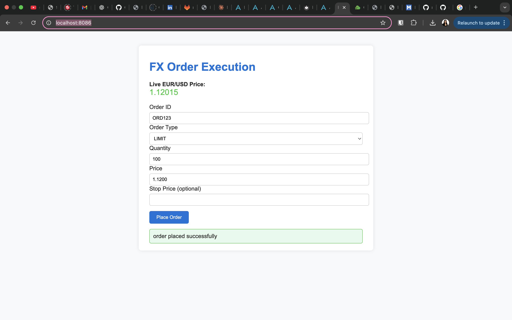

# FX Order Execution – Multi-Module Maven Project

A multi-module Maven project (Java + Spring Boot) demonstrating an FX order-execution stack with FIX I/O, real-time price streaming, order management, and an AI-powered trading assistant.

## Modules

- **fix-server** – FIX protocol server that listens for incoming FIX messages.
- **price-streaming** – Publishes real-time price updates.
- **order-management** – Manages and processes orders (also serves the UI for orders).
- **ai-assistant** (NEW) – An AI trading assistant (Spring AI + OpenAI) that lets you query the system in natural language.

## Project Structure
```
fx-order-execution/
├── pom.xml                        # Parent POM
├── order-management/              # Order Management Module
│   ├── pom.xml
│   └── src/main/java/com/example/fx/order/management/...
├── price-streaming/               # Price Streaming Module
│   ├── pom.xml
│   └── src/main/java/com/example/fx/price_streaming/...
├── fix-server/                    # FIX Server Module
│   ├── pom.xml
│   └── src/main/java/com/example/fx/fix/server/...
└── ai-assistant/                  # AI Assistant Module (NEW)
    ├── pom.xml
    └── src/main/java/com/example/fx/assistant/
        ├── TradingAssistantApplication.java
        ├── config/AIConfiguration.java
        ├── controller/TradingAssistantController.java
        ├── functions/TradingFunctions.java
        ├── model/Order.java
        └── service/OrderService.java
```

## Prerequisites

- Java 17 or higher
- Maven 3.6+
- OpenAI API Key (for AI Assistant module)

## Build Instructions

To build the project, navigate to the root directory and run:

```bash
mvn clean install
```

This will compile and package all modules.

## Run Sequence

The modules must be started in the following order:

### 1. Run the FIX Server
Navigate to the `fix-server` module and start the application:

```bash
cd fix-server
mvn spring-boot:run
# listens on port 9878
```

The FIX server will start listening on port 9878.

### 2. Run the Price Streaming Server
Navigate to the `price-streaming` module and start the application:

```bash
cd ../price-streaming
mvn spring-boot:run
```

The price streaming service will start.

### 3. Run the Order Management Server
Navigate to the `order-management` module and start the application:

```bash
cd ../order-management
mvn spring-boot:run
```

The order management service will start. The UI will be served at the order management port.

### 4. Run the AI Assistant Server
Navigate to the `ai-assistant` module and start the application:

```bash
cd ../ai-assistant
mvn spring-boot:run
```

The AI assistant service will start.

### 5. Access the Application
The application will be available at http://localhost:8080.

### 6. Interact with the AI Assistant
Use the chat interface to interact with the AI trading assistant.

### 7. Use the APIs
You can use the provided APIs to place orders and stream prices.

### 8. Stop the Modules
Stop each module in reverse order when done.

## Basic APIs

Here are some basic APIs you can use to interact with the system:

### Order Management APIs

#### Place an Order

**POST** `/orders/place`

**Request Body:**
```json
{
   "orderId": "ORD123",
   "symbol": "EUR/USD",
   "quantity": 100,
   "price": 1.1234,
   "side": "BUY"
}
```

**Response:**
```json
{
   "status": "SUCCESS",
   "message": "Order placed successfully"
}
```

### Streaming APIs

#### Live Streaming price

**GET** `/streaming-price/prices`

**Response:**
```json
{
   "data":"1.121400184622543"
}
```

## AI Assistant (NEW)

The `ai-assistant` module adds a natural-language layer over your trading system using Spring AI function calling.

### What it can do

1. **Natural Language Interface** – "What orders do I have?"
2. **Order Management** – "Buy 100 EUR/USD"
3. **Position Analysis** – "What's my exposure to EUR/USD?"
4. **Real-time Price** – "What's the current price of EUR/USD?"
5. **Trade Suggestions** – "Recommend a trade for EUR/USD today"

### Screenshots

#### AI Trading Assistant Interface
Chat with your trading system using natural language.


#### FX Order Management UI
Traditional order management interface.



## Troubleshooting

### Common Issues

**Connection refused / timeouts**
- Ensure all four services are running and ports match config.

**AI not responding**
- Check `OPENAI_API_KEY`, model name, and API quota. Look at the `ai-assistant` logs for details.

## Notes

- Ensure all modules are running in the correct sequence to avoid errors.
- The FIX server handles incoming FIX messages and sends execution reports.
- The price streaming service publishes real-time price updates.